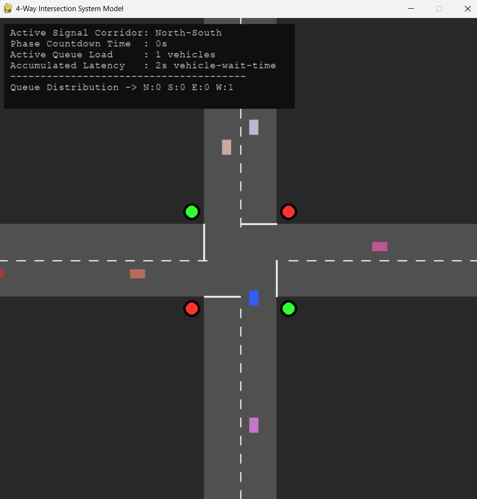

# 🚦 Smart Traffic Intersection Simulation

A Python-based traffic intersection simulator built using **Pygame** that models a four-way road intersection with intelligent traffic light control, vehicle spawning, collision avoidance, queue monitoring, and real-time traffic statistics.

This project demonstrates fundamental concepts of **Simulation & Modeling**, **Traffic Engineering**, and **Object-Oriented Programming**.

---

## 📌 Features

- 🚗 Four-way traffic intersection
- 🚦 Automatic traffic light system
- 🚙 Random vehicle generation
- 🛑 Collision avoidance between vehicles
- ⏳ Vehicle waiting time calculation
- 📊 Queue length monitoring
- 📈 Traffic delay statistics
- 🎮 Real-time visualization using Pygame
- ⚡ Smooth vehicle acceleration and deceleration

---

## 🖥️ Demo

<p align="center">
  
</p>


The simulator contains:

- North-South and East-West traffic signals
- Dynamic vehicle spawning
- Intelligent stopping at red lights
- Queue management
- Performance metrics panel
- Continuous traffic simulation

---

## 🛠️ Technologies Used

- Python 3.x
- Pygame
- Object-Oriented Programming (OOP)

---

## 📂 Project Structure

```
Smart-Traffic-Intersection-Simulation/
│
├── README.md
├──demo.png
├── requirements.txt
└── traffic.py
```

---

## ⚙️ Installation

Clone the repository

```bash
git clone https://github.com/ishbarna/Smart-Traffic-Intersection-Simulation.git
```

Go to the project folder

```bash
cd Smart-Traffic-Intersection-Simulation
```

Install dependencies

```bash
pip install pygame
```

or

```bash
pip install -r requirements.txt
```

---

## ▶️ Run the Project

```bash
python traffic.py
```

---

## 🎮 Controls

| Key | Action |
|------|---------|
| ESC | Exit Simulation |
| Close Window | Quit Program |

---

## 🚥 Simulation Components

### Vehicle System

- Random vehicle generation
- Multiple driving directions
- Smooth acceleration
- Smooth deceleration
- Collision prevention
- Vehicle queue management

### Traffic Light Controller

- Automatic signal switching
- Green phase timing
- Yellow phase timing
- Red signal control

### Traffic Metrics

- Queue length
- Waiting vehicles
- Total delay
- Active traffic signal
- Signal countdown timer

---
## 📊 Performance Metrics

The simulator continuously measures:

- Total waiting time
- Queue size
- Number of stopped vehicles
- Active traffic signal
- Signal countdown

---

## 🎯 Learning Objectives

This project demonstrates:

- Traffic flow simulation
- Event-driven programming
- Object-Oriented Design
- Vehicle behavior modeling
- Queue management
- State machine implementation
- Pygame graphics programming
- Basic traffic engineering principles

---

## 📚 Concepts Used

- Simulation and Modeling
- Traffic Signal Scheduling
- Queue Theory
- Collision Detection
- Sprite Management
- Randomized Simulation
- Finite State Machine (FSM)
- Real-Time Rendering

---

## 🚀 Future Improvements

- Emergency vehicle priority
- AI-based adaptive traffic lights
- Multi-lane roads
- Pedestrian crossings
- Vehicle turning system
- Traffic density graphs
- Data export to CSV
- Machine Learning traffic optimization

---


## 📄 Requirements

```
Python >= 3.9
Pygame >= 2.5
```

---

## ⭐ Support

If you found this project useful, consider giving it a ⭐ on GitHub.
